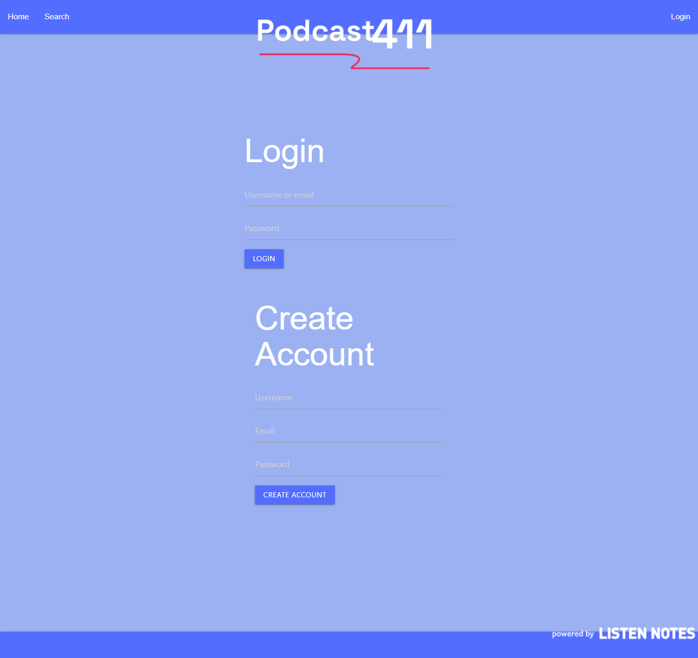
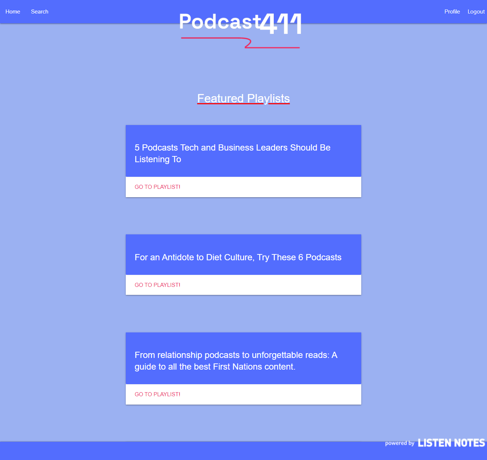
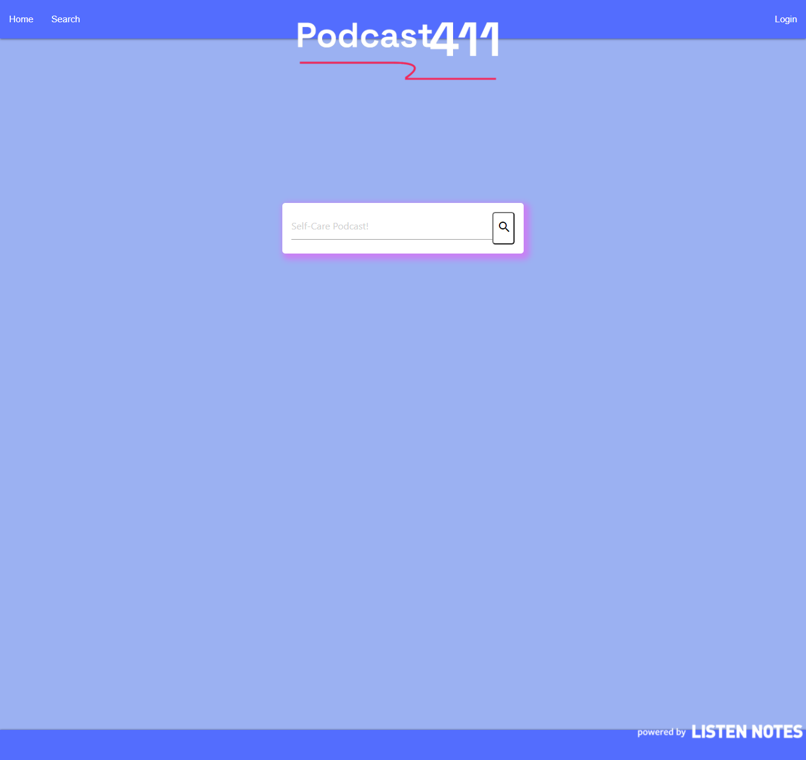
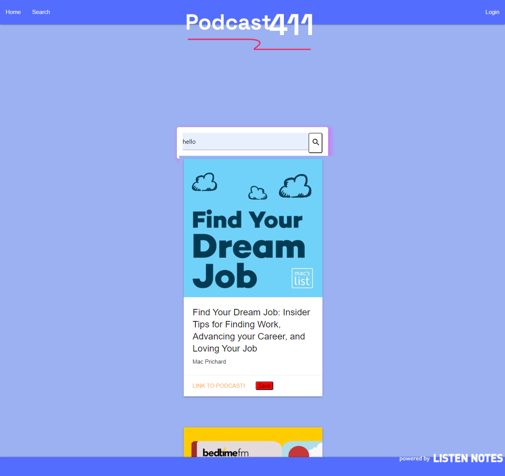
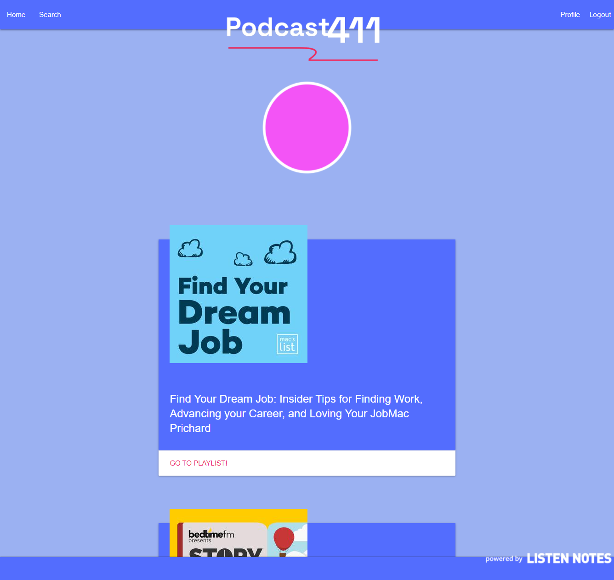

# Podcast411

## Description

 This awesome podcast site gets you information on podcasts. Powered by Listen Notes, just search for a podcast or look around at the top podcasts list. Create an account today! The application saves unique users and their favorite podcasts to their profile playlist. During this project, I learned how to work with server-side API calls.

## Table of Contents

- [Installation](#installation)
- [Usage](#usage)
- [Credits](#credits)
- [License](#license)

## Installation

Go to the deployed link [here](https://pod-ap.herokuapp.com/) or the github repo [here](https://github.com/MaxStump13/Podcast411). To work locally, the user will need to clone the repo and install the express, express-sessions, sequelize, dotenv, express-handlebars, connect-session-sequelize, bcrypt, MySQL, and podcast-api packages. On the front end, the user needs jquery, materialize, and slick links.

## Usage

When the user gets to the site. The home page will look like the image below, with a list of links to podcasts that is updated daily.    

When the user clicks on the login button, they are taken to a login/signup page. 

When the user signs up, they're unique info will be stored to session variables. This allows them to log back in and save data uniquely to their account. After signing in, you are taken back to the home and a profile button appears beside the logout button in the nav.

If the user clicks the search button they are taken to the following search page.

After a search is entered, the results of 25 related podcasts populate below the search bar. Each podcast has a link to go directly to it and a save button.

When the save button is clicked, the podcast is saved to the users profile. If the user clicks profile, all saved podcasts are displayed underneath.

## Credits

1. [Ray Hewitt ](https://github.com/Rayman244)
2. [Giovanna Ruggio](https://github.com/giovannaruggio)
3. [Katelynn McCann](https://github.com/katelynndonahue)
4. [Materialize](https://materializecss.com/about.html)
5. [ListenNotes](https://www.listennotes.com/api/docs/)
6. [Slick](https://kenwheeler.github.io/slick/)

## License

MIT License

Copyright (c) 2022 Maximilian Stump

Permission is hereby granted, free of charge, to any person obtaining a copy
of this software and associated documentation files (the "Software"), to deal
in the Software without restriction, including without limitation the rights
to use, copy, modify, merge, publish, distribute, sublicense, and/or sell
copies of the Software, and to permit persons to whom the Software is
furnished to do so, subject to the following conditions:

The above copyright notice and this permission notice shall be included in all
copies or substantial portions of the Software.

THE SOFTWARE IS PROVIDED "AS IS", WITHOUT WARRANTY OF ANY KIND, EXPRESS OR
IMPLIED, INCLUDING BUT NOT LIMITED TO THE WARRANTIES OF MERCHANTABILITY,
FITNESS FOR A PARTICULAR PURPOSE AND NONINFRINGEMENT. IN NO EVENT SHALL THE
AUTHORS OR COPYRIGHT HOLDERS BE LIABLE FOR ANY CLAIM, DAMAGES OR OTHER
LIABILITY, WHETHER IN AN ACTION OF CONTRACT, TORT OR OTHERWISE, ARISING FROM,
OUT OF OR IN CONNECTION WITH THE SOFTWARE OR THE USE OR OTHER DEALINGS IN THE
SOFTWARE.

## Badges

## Features
- Complete C.R.U.D. functionality 
- Create a user
- Add podcasts to your account
- get information about any podcast

## How to Contribute

 https://github.com/MaxStump13/Podcast411

## Tests
 No errors to report
  
 ## Questions
 message me on Github https://github.com/MaxStump13/
 email me at [stumpmaximilian@gmail.com](mailto:stumpmaximilian@gmail.com)